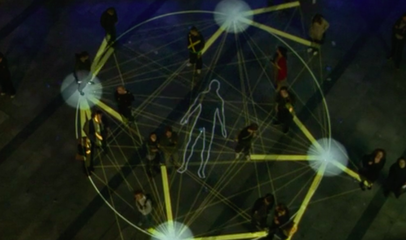

# 1701QCA Final project journal: *Insert your name here*

<!--- As for other assessments, fill out the following journal sections with information relevant to your project. --->

<!--- Markdown reference: https://guides.github.com/features/mastering-markdown/ --->

## Related projects ##
<!--- Find about 6 related projects to the project you choose. A project might be related through  function, technology, materials, fabrication, concept, or code. Don't forget to place an image of the related project in the appropriate folder and insert the filename in the appropriate places below. Copy the markdown block of code below for each project you are showing. --->

### Related project 1 ###
*Gravity of light*

*https://www.trendhunter.com/trends/led-hat*

This project is related to mine because of the way it uses light and movement to create an interactive item. this hat reacts to differnt movements and wil display a light show according to them.

### Related project 2 ###
*Arduino Accelerometer Data Logger Project*

*https://www.youtube.com/watch?v=7EBpjjKGRJQ*

This project is related to mine because of the use of an accelerometre. using an accelerometre the man craeted a data logger to learn about what happens when a car accelerwates and goes around corners.

### Related project 3 ###
*Great Street Games*

*https://www.trendhunter.com/trends/great-street-games*

This project is related to mine because of its use of movement and coreponding light shows. this project gets a community involved to play games with light.

### Related project 4 ###
*gesture controled robot*

*https://www.youtube.com/watch?v=rejZmqRrKMc*

This project is related to mine because of its use of motion using an accelerometer. using an accelerometer and the directional movemnt of the users had the robot will move according to the controller.

### Related project 5 ###
*Color Mountain*

*https://www.trendhunter.com/trends/color-mountain*

This project is related to mine because through motion of people on a snowboard different lights are being projected onto the snow hills.

### Related project 6 ###
*Arduino Project-Self Balancing Robot*

*https://www.youtube.com/watch?v=I6z26LVu5y0*

This project is related to mine because using the accelerometer it corrects its orrientation to stay up right.

## Other research ##
<!--- Include here any other relevant research you have done. This might include identifying readings, tutorials, videos, technical documents, or other resources that have been helpful. For each particular source, add a comment or two about why it is relevant or what you have taken from it. You should include a reference or link to each of these resources. --->

## Conceptual progress ##

### Design intent ###
Create a interactive device that displays lights/Information depending on movement

### Design concept 1 ###
a cube with multiple faces and functions. for example, one side displays time, one temperature, one weather. using the accelerometre it can detect what side its facing and display the correspodning information. 

### Design concept 2 ###
a mood tracker. a small device with a series of steps it can be placed on. depending on your mood each day you can put the device higher or lower and it will display a color depending on what mood step youve put it on. could be a good way to tell people how your feeling without saying it.

### Final design concept ###
an object that sits niceley on a bedside table that is flipped to different sides to create different light show. examples like a a fast stobe to pair with some music for a bedroom party. a slow transitioning color wheel for if you need something mellow to fill the room. single color projection to fill a room with a certain color. a regular light to make a room brighter.

## Physical experimentation documentation ##

*In this section, show your progress including whichever of the following are appropriate for your project at this point.
a.	Technical development. Could be code screenshots, pictures of electronics and hardware testing, video of tests. 
b.	Fabrication. Physical models, rough prototypes, sketches, diagrams of form, material considerations, mood boards, etc.
Ensure you include comments about the choices you've made along the way.*

*You will probably have a range of images and screenshots. Any test videos should be uploaded to YouTube or other publicly accessible site and a link provided here.*

## Final code ##

<!--- Include here screenshots of the final code you used in the project if it is done with block coding. If you have used javascript, micropython, C, or other code, include it as text formatted as code using a series of three backticks ` before and after the code block. See https://guides.github.com/features/mastering-markdown/ for more information about that formatting. --->

## Design process discussion ##
<!--- Discuss your process used in this project, particularly with reference to aspects of the Double Diamond design methodology or other relevant design process. --->

## Reflection ##

<!--- Describe the parts of your project you felt were most successful and the parts that could have done with improvement, whether in terms of outcome, process, or understanding.

What techniques, approaches, skills, or information did you find useful from other sources (such as the related projects you identified earlier)?

What parts of your project do you feel are novel? This is IMPORTANT to help justify a key component of the assessment rubric.

What might be an interesting extension of this project? In what other contexts might this project be used? --->
